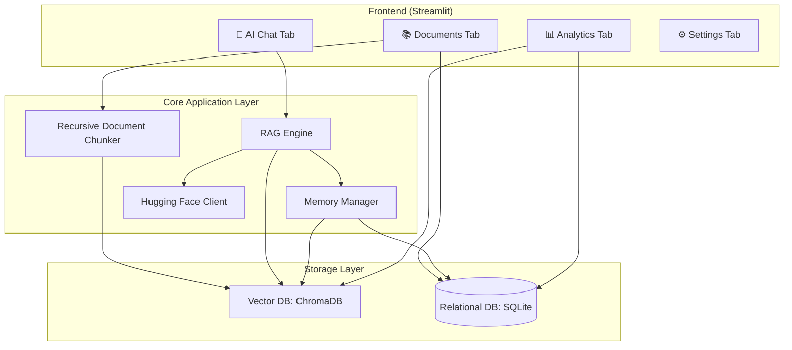
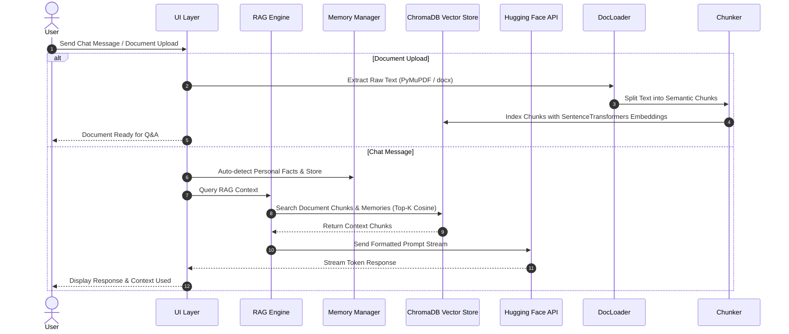

# 🧠 AI Personal Knowledge Assistant

> A Production-Ready AI Agent with Long-Term Memory, RAG, Document Intelligence, and Modern UI built using Hugging Face, ChromaDB, and Streamlit.

---

## 🌟 Overview

**AI Personal Knowledge Assistant** is an end-to-end, local-first artificial intelligence assistant designed for personal knowledge management, document semantic search, and contextualized chat interactions. Built completely without heavy agent orchestration frameworks (such as LangChain), it implements hand-crafted RAG pipelines, sliding-window recursive chunking, and dual-tier persistent storage (ChromaDB + SQLite).

---

## 🚀 Key Features

- 💬 **Modern Glassmorphic UI**: Vibrant dark mode aesthetics with responsive sidebar navigation and custom chat bubbles.
- ⚡ **Streaming AI Responses**: Real-time token streaming using Hugging Face Serverless Inference API (Llama 3.2 3B, Mistral 7B, Qwen 2.5 72B).
- 🧠 **Long-Term Memory Engine**: Automatic extraction of user facts and semantic vector recall stored in ChromaDB and SQLite.
- 📚 **Document Intelligence (RAG)**: Parse, chunk, and index PDFs, DOCX, and TXT files using PyMuPDF and python-docx.
- 📊 **Analytics Dashboard**: Interactive Plotly charts displaying session volume, document type distributions, and active memory management.
- 📥 **Transcript Exporters**: Export chat conversations directly to `.txt` or `.md` Markdown files.
- ⚙️ **Configurable Hyperparameters**: Real-time adjustment of top-k chunks, temperature, top-p, and max token limits.

---

## 🛠️ Tech Stack

- **Language**: Python 3.12+
- **Frontend**: Streamlit (Vanilla CSS with Glassmorphism)
- **LLM**: Hugging Face Inference API (`huggingface_hub`)
- **Embeddings**: `sentence-transformers/all-MiniLM-L6-v2`
- **Vector Database**: ChromaDB
- **Relational Database**: SQLite
- **PDF Processing**: PyMuPDF (`fitz`)
- **DOCX Processing**: `python-docx`
- **Visualizations**: Plotly & Pandas

---

## 📐 Architecture Diagram



---

## 🔄 Workflow Diagram



---

## 📁 Project Structure

```
AI_Personal_Knowledge_Assistant/
├── app.py                   # Main Streamlit entrypoint
├── config.py                # Configuration and environment defaults
├── requirements.txt         # Production Python packages
├── README.md                # Project documentation
├── LICENSE                  # MIT License
├── .gitignore               # Excludes storage, DBs, env, caches
├── .env.example             # Template environment variables
├── frontend/
│   ├── styles.py            # Custom CSS Dark Glassmorphism stylesheet
│   ├── components.py        # Reusable UI widgets and cards
│   ├── chat_page.py         # AI Chat tab with streaming & session management
│   ├── documents_page.py    # Knowledge Document uploader and manager
│   ├── analytics_page.py    # Analytics dashboard and memory manager
│   └── settings_page.py     # API Token and model setting configuration
├── llm/
│   └── hf_client.py         # Hugging Face InferenceClient wrapper
├── memory/
│   └── memory_manager.py    # Dual SQLite + ChromaDB long-term memory store
├── database/
│   └── db_manager.py        # SQLite schema manager and SQL queries
├── documents/
│   ├── doc_loader.py        # PDF & DOCX text extraction
│   └── doc_chunker.py       # Recursive text splitting algorithm
├── retriever/
│   └── retriever.py         # ChromaDB semantic search retriever
├── rag/
│   └── rag_engine.py        # RAG prompt construction and pipeline
├── analytics/
│   └── analytics_engine.py  # Data aggregation for charts
├── export/
│   └── export_manager.py    # TXT & Markdown transcript exporter
├── utils/
│   ├── logger.py            # Centralized logging
│   └── helpers.py           # Text cleaning and formatting helpers
└── tests/
    ├── test_db.py           # SQLite unit tests
    └── test_chunker.py      # Chunker unit tests
```

---

## ⚡ Installation & Quickstart

### 1. Clone & Navigate to Repository
```bash
git clone https://github.com/your-username/AI-Personal-Knowledge-Assistant.git
cd AI-Personal-Knowledge-Assistant
```

### 2. Set Up Virtual Environment (Recommended)
```bash
python -m venv venv
# On Windows:
venv\Scripts\activate
# On Linux/macOS:
source venv/bin/activate
```

### 3. Install Dependencies
```bash
pip install -r requirements.txt
```

### 4. Set Environment Variables
Copy `.env.example` to `.env` and add your Hugging Face API key:
```bash
HF_TOKEN=your_huggingface_api_token_here
```

### 5. Launch Application
```bash
streamlit run app.py
```

---

## 🧪 Running Unit Tests

Run automated unit tests to verify database, memory, and chunking integrity:
```bash
python -m unittest discover tests
```

---

## 📜 License

Distributed under the MIT License. See [LICENSE](LICENSE) for more details.
